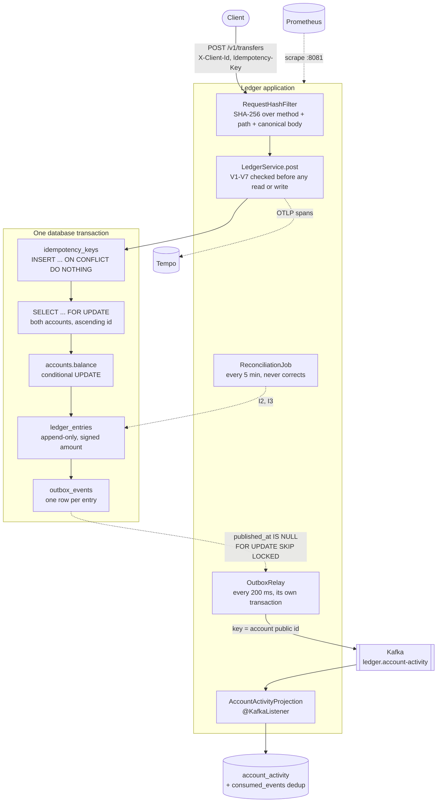
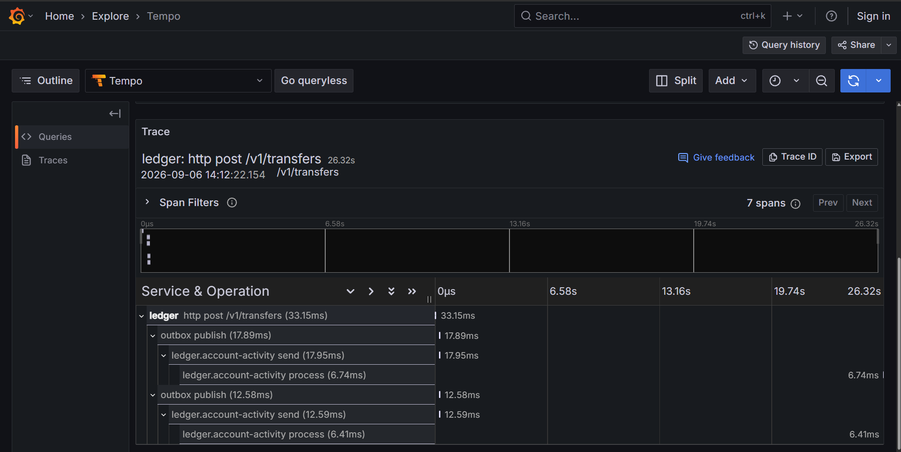
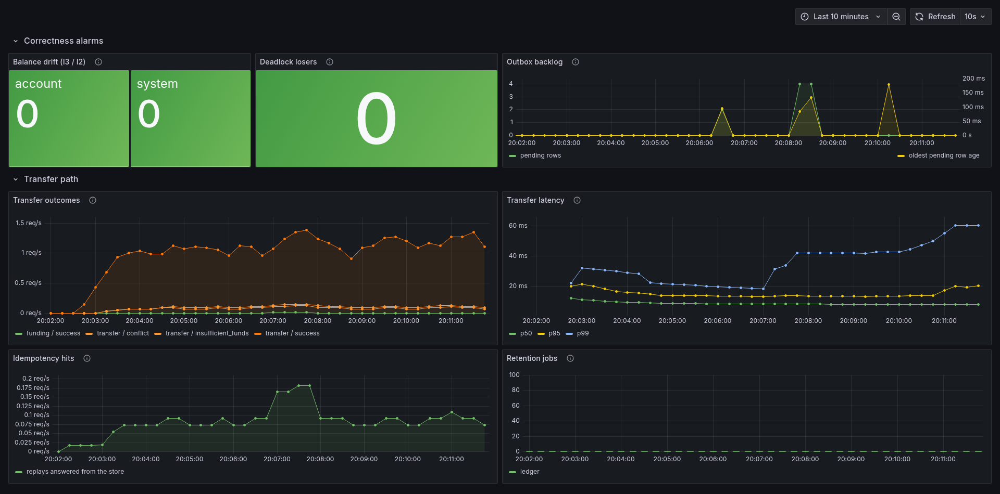

# Ledger Payment Core

[](https://github.com/Baran-Ozkann/ledger-payment-core/actions/workflows/ci.yml)

A payment core built on a double-entry accounting ledger with idempotent transfers, written to find
out what it takes to *prove* that money is neither created nor destroyed. Every guarantee here has a
database-level defense — a constraint, a trigger, an index or a grant — a test that asserts it, and
a recorded break proof showing that the test fails when the mechanism is removed. It is a study
project rather than a deployed service: single node, single currency, no authentication, credentials
in the repository. The [known limits](#known-limits) section says exactly where it stops.

The interesting parts are not the happy path. They are [ADR-009](docs/adr/009-validation-rules-are-not-invariants.md),
which shows three requests that satisfy all eight invariants while moving money nobody authorised;
[the load results](load/RESULTS.md), where one shared row costs a factor of 5.5 and SERIALIZABLE
turns out to be faster until it isn't; and [what a green test suite did not
catch](#what-a-green-test-suite-did-not-catch), which is three times this project's tests were
passing and proving nothing.

---

## Architecture



Three things in that picture carry most of the design:

- **The idempotency claim, the money and the event commit together.** One transaction, so a row
  another request can see is always a finished one ([ADR-005](docs/adr/005-idempotency-in-transaction.md)).
- **The event is a row, not a broker call.** It cannot disagree with the entries it was written
  beside ([ADR-003](docs/adr/003-transactional-outbox.md)).
- **Both accounts are locked in ascending internal id order** before either is written, so two
  opposing transfers queue instead of deadlocking ([ADR-004](docs/adr/004-ordered-locking.md)).

---

## Quick start

Docker is the only requirement. No JDK, no Maven — the image builds the jar itself. `demo-accounts`
runs once, creates two accounts through the API, funds one of them, and prints a ready-to-run
request with the ids filled in, so the step after `docker compose up` really is a single transfer.

The whole of it, from an empty machine to a transfer that will not happen twice. A real session,
abbreviated only where marked `...`:

```console
$ docker compose up -d --build
...                                     # builds the image, then waits for health checks

$ docker compose logs demo-accounts
demo-accounts-1  |   The ledger is up, with two demo accounts and money in one of them.
demo-accounts-1  |   Balances are in kurus, which is the only unit this API speaks.
demo-accounts-1  |
demo-accounts-1  |     alice  8f951015-9ba0-4253-ab94-cb88d789e787   1000000
demo-accounts-1  |     bob    3e7f6a4a-deb3-4365-b5a0-5094940408a2   0
...

$ curl -i -X POST http://127.0.0.1:8080/v1/transfers \
    -H 'Content-Type: application/json' -H 'X-Client-Id: demo' \
    -H 'Idempotency-Key: first-transfer' \
    -d '{"from_account":"8f951015-9ba0-4253-ab94-cb88d789e787","to_account":"3e7f6a4a-deb3-4365-b5a0-5094940408a2","amount":1250,"description":"Coffee"}'
HTTP/1.1 201
Content-Type: application/json

{"id":"aac18a87-e553-4a08-837f-c0a6e494d16e","tx_type":"TRANSFER","description":"Coffee","created_at":"2026-09-09T20:02:00.201978Z","entries":[{"id":3,"transaction_id":"aac18a87-e553-4a08-837f-c0a6e494d16e","account_id":"8f951015-9ba0-4253-ab94-cb88d789e787","amount":-1250,"currency":"TRY","created_at":"2026-09-09T20:02:00.201978Z"},{"id":4,"transaction_id":"aac18a87-e553-4a08-837f-c0a6e494d16e","account_id":"3e7f6a4a-deb3-4365-b5a0-5094940408a2","amount":1250,"currency":"TRY","created_at":"2026-09-09T20:02:00.201978Z"}]}

$ curl -i -X POST http://127.0.0.1:8080/v1/transfers ...    # the same request, byte for byte
HTTP/1.1 201
Content-Type: application/json

{"id": "aac18a87-e553-4a08-837f-c0a6e494d16e", "entries": [{"id": 3, "amount": -1250, ...

$ curl -s http://127.0.0.1:8080/v1/accounts/3e7f6a4a-deb3-4365-b5a0-5094940408a2
{"id":"3e7f6a4a-deb3-4365-b5a0-5094940408a2","account_type":"LIABILITY","owner_ref":"demo-bob","currency":"TRY","balance":1250,"allow_negative":false,"created_at":"2026-09-09T20:01:45.057385Z"}
```

Two entries, `-1250` and `+1250`, and bob is up by 1250 rather than 2500: the second call returned
the first call's transaction — same id, same entry ids `3` and `4`, same `created_at` — instead of
making a second one. It is spelled differently because it is not the same document. The first
response is what Jackson serialized; the replay is that document read back out of a `jsonb` column,
which PostgreSQL returns with its keys reordered and a space after every colon. Equal as JSON,
different as bytes, and the ledger behind them was written exactly once.

Change the `Idempotency-Key` and it becomes a new transfer. Keep the key but change the body and it
is refused — `422 urn:ledger:idempotency_key_reuse`, because the stored request hash no longer
matches what was sent.

| | |
|---|---|
| API | http://127.0.0.1:8080 — loopback only; it moves money and has no authentication |
| Grafana | http://127.0.0.1:3000 — anonymous, the ledger dashboard is provisioned |
| Prometheus | http://127.0.0.1:9090 |
| Tempo | http://127.0.0.1:3200 — traces, also reachable through Grafana |
| PostgreSQL | `psql -h 127.0.0.1 -p 5433 -U ledger ledger`, password `ledger` |

Port 5433, not 5432: a machine with its own PostgreSQL already answers on 5432, and a run pointed at
the wrong database produces numbers that look entirely reasonable and mean nothing. The ledger
service does not use the published port at all — it reaches the database by service name.

Running the tests needs a JDK 21 and a Docker daemon for Testcontainers:

```bash
./mvnw verify          # everything
bash ci/check-rules.sh # the project rules CI enforces
```

---

## The eight invariants

These are the reason the system exists. Each is enforced in the database; enforcing one in the
application layer is forbidden by [CONVENTIONS.md](CONVENTIONS.md).

| # | Invariant | Enforcement | Where |
|---|---|---|---|
| I1 | Entries of a transaction sum to zero | Deferred constraint trigger `trg_tx_balanced` | `V3__balanced_transaction_trigger.sql` |
| I2 | All entries in the system sum to zero | `ReconciliationJob` + property test over 1 000 random sequences | `recon/`, `LedgerInvariantPropertiesTest` |
| I3 | An account's balance equals the sum of its entries | `ReconciliationJob` batched per id range + `ledger_balance_drift_total` alarm | `AccountRepository.findDrift` |
| I4 | An account with `allow_negative = false` cannot go negative | `CHECK (allow_negative OR balance >= 0)` + the affordability test in the `WHERE` of the debit | `V2`, `V6`, `AccountRepository.debit` |
| I5 | Entries are immutable | Trigger that RAISEs **and** role grants: `ledger_app` holds no UPDATE, DELETE or TRUNCATE, and owns no table, so it cannot disable the trigger either | `V4`, `V12` |
| I6 | A `(client_id, idempotency_key)` pair maps to at most one transaction | `UNIQUE (client_id, idem_key)` | `V8__idempotency.sql` |
| I7 | An entry's currency matches its account's | `BEFORE INSERT` trigger `trg_entry_currency` | `V5` |
| I8 | All entries of a transaction share one currency | Deferred constraint trigger `trg_tx_single_currency` | `V7` |

I8 was not in the original list. It was added after the phase 1b review found that a transaction of
−1000 TRY and +1000 USD satisfies I1, I2, I3 and I7 while inventing money —
[ADR-009](docs/adr/009-validation-rules-are-not-invariants.md) tells that story.

## The seven validation rules

The invariants above do not cover these. Each is a separate API-level rule, and skipping any of them
lets money be created while every invariant still holds.

| # | Rule | Response | Test |
|---|---|---|---|
| V1 | Amount strictly positive | `422 invalid_amount` | `negativeAmountRejected`, `zeroAmountRejected` |
| V2 | Amount at most 10 000 000 000 kuruş | `422 amount_too_large` | `oversizedAmountRejected` |
| V3 | `from_account` differs from `to_account` | `422 self_transfer` | `selfTransferRejected` |
| V4 | Amount is an integer; decimals refused at deserialization | `400` | `decimalAmountRejected` |
| V5 | `X-Client-Id` required on mutating endpoints | `400 missing_client_id` | `missingClientIdRejected` |
| V6 | `Idempotency-Key` required on mutating endpoints | `400 missing_idempotency_key` | `missingIdempotencyKeyRejected` |
| V7 | Both accounts share a currency | `422 currency_mismatch` | `crossCurrencyTransferRejected` |

**V1, V3 and V7 cannot be written as invariants at all**, and that is not a gap in the schema. An
invariant is a statement about the state the ledger is in; these are statements about the request
that produced it, and a negative transfer leaves a state indistinguishable from a legitimate
transfer in the opposite direction. With V1 removed, a request naming alice as the source is
answered `201 CREATED` and moves a hundred kuruş **from bob to alice**, with I2 at zero and no
account drifting. The break proof is in [ADR-009](docs/adr/009-validation-rules-are-not-invariants.md).

---

## API

Every mutating endpoint requires `X-Client-Id` and `Idempotency-Key`. The idempotency key is scoped
to the client id, and the stored request hash is SHA-256 over the HTTP method, the path and the
canonicalized body — method and path included, so one key cannot collide across a transfer and a
reversal. Errors are RFC 7807 problem details whose `type` is `urn:ledger:<code>`.

| Method | Path | Purpose |
|---|---|---|
| `POST` | `/v1/accounts` | Create an account. `account_type` is one of ASSET, LIABILITY, EQUITY, REVENUE, EXPENSE. `allow_negative` is derived from the type and cannot be requested |
| `GET` | `/v1/accounts/{id}` | The account and its materialized balance |
| `GET` | `/v1/accounts/{id}/entries?after=&limit=` | History, newest first, cursor paginated ([ADR-008](docs/adr/008-cursor-pagination.md)). `limit` at most 200; `next_after` is null on the last page |
| `POST` | `/v1/funding` | Money enters the ledger: EQUITY debited, LIABILITY credited, balanced like any other transaction |
| `POST` | `/v1/transfers` | A transfer. Body: `from_account`, `to_account`, `amount` (kuruş, integer), `description` |
| `GET` | `/v1/transfers/{id}` | The transaction and its entries |
| `POST` | `/v1/transfers/{id}/reversals` | A compensating transaction. The original is never touched; the reversal can be refused if it would overdraw the counterpart |

Amounts are always integers of minor units. `1250` is 12,50 TRY; `1250.00` is a `400`
([ADR-007](docs/adr/007-bigint-minor-units.md)).

Read-only endpoints live on a management connector of their own on port 8081 — `/actuator/health`
and `/actuator/prometheus` — which is what makes them reachable from a container without exposing
the API. The split was also meant to keep the metrics alive while the API saturated; re-running the
load that killed them shows it does not, because the scrape blocks on the connection pool rather
than on a thread. See below.

---

## Event contract

Every ledger entry produces one event on the topic `ledger.account-activity`, published by the
outbox relay ([ADR-003](docs/adr/003-transactional-outbox.md)). A transfer writes two entries, so
it produces two events, one for each account.

| Part | Value |
|---|---|
| Key | The account's public id, as a UUID string. Every event for one account lands on one partition, so events are ordered per account and not across the topic |
| Header `event-id` | **Required.** The outbox row id as a decimal string. This is the deduplication key: delivery is at-least-once, and a repeat carries the same `event-id` |
| Value | A UTF-8 JSON object, below |

| Field | JSON type | Meaning |
|---|---|---|
| `transaction_id` | string (UUID) | Public id of the transaction the entry belongs to |
| `account_id` | string (UUID) | Public id of the account the entry was posted to; equal to the key |
| `amount` | integer (int64) | Signed, in minor units: negative on the account that was debited |
| `currency` | string | ISO 4217 code of the entry |
| `tx_type` | string | `TRANSFER`, `FUNDING` or `REVERSAL` today; the schema already allows further types |
| `entry_id` | integer (int64) | `ledger_entries.id` of the entry this event describes. A reversal's events name the reversal's own entries, never the original's |
| `created_at` | string | That entry's `created_at`: UTC, always six fractional digits, `yyyy-MM-ddTHH:mm:ss.SSSSSSZ` — for example `2026-09-24T00:00:00.000000Z`. Fixed width, so the strings sort as the instants do |

`created_at` is when the ledger wrote the entry, not when the relay published it. The Kafka record
timestamp is the publish time, which falls on the wrong side of a date boundary whenever the relay
is behind. The column defaults to `now()`, which is the start of the database transaction, so both
entries of one transfer carry the same `created_at`.

**Events written before `entry_id` and `created_at` existed carry only the first five fields.**
That covers everything already on the topic, which a consumer group reading from the start will see
first, and any outbox row still unpublished when the change was deployed. Nothing is backfilled.

The contract only grows. Fields are appended; none is renamed, retyped or removed.
`OutboxRelayTest.deliveredPayloadKeepsTheContractShape` reads the delivered bytes as plain JSON and
fails on any other shape.

---

## Test strategy

`./mvnw verify` runs **97 tests in 2 m 49 s**, PostgreSQL and Kafka containers included. CI splits
them into two jobs, so a broker that will not start is never mistaken for a ledger that does not
work.

Testcontainers with a real PostgreSQL and a real Kafka. No H2, no embedded broker, no mocked
database. Concurrency tests are never `@Transactional` — a test transaction hides real concurrency —
and they release their threads through a single `CountDownLatch`, because merely starting threads
does not produce simultaneity.

### Which test proves what

| Guarantee | Test |
|---|---|
| I1 balanced transaction | `BalancedTransactionTest.unbalancedTransactionRejected` |
| I2 global sum is zero | `LedgerInvariantPropertiesTest.everyEntryInTheSystemSumsToZero` (jqwik, 1 000 random sequences) |
| I3 balance equals its entries | `LedgerInvariantPropertiesTest.everyBalanceEqualsTheSumOfItsEntries`, `ReconciliationJobTest.reconciliationDetectsDrift` |
| I3 drift is never auto-corrected | `ReconciliationJobTest.reconciliationDoesNotAutoFix` |
| I4 no negative balance | `SchemaConstraintTest.negativeBalanceRejected`, `TransferConcurrencyTest.overdraftUnderRace` |
| I4 only EQUITY may go negative | `SchemaConstraintTest.allowNegativeCannotBeSet`, `allowNegativeFollowsAccountType` |
| I5 append-only, by trigger | `ImmutabilityTest` (update and delete, entries and transactions) |
| I5 append-only, by grant | `AppRolePrivilegesTest.appRoleCannotRewriteOrRemoveLedgerHistory`, `appRoleOwnsNoneOfTheLedgerTables` |
| I6 one key, one transaction | `IdempotencyKeyTest.duplicateClientKeyRejected`, `IdempotencyTest.duplicateIdempotencyKey` (100 threads) |
| I7 entry currency | `EntryCurrencyTest.mismatchedCurrencyRejected` |
| I8 one currency per transaction | `TransactionCurrencyTest.mixedCurrencyTransactionRejected` |
| V1–V7 | `TransferValidationTest`, one test per rule |
| No deadlock under opposing transfers | `TransferConcurrencyTest.bidirectionalNoDeadlock`, run five consecutive times |
| A repeat gets the first attempt's response | `IdempotencyTest.replayedCreateReturnsTheStoredResponse`, `sameKeyDifferentBody`, `sameKeyDifferentEndpoint` |
| Event written atomically with the money | `OutboxWriteTest.outboxWrittenAtomically`, `outboxNotWrittenOnRollback` |
| An event names its own entry, to the microsecond | `OutboxWriteTest.eventNamesTheEntryItDescribes`, `reversalEventsNameTheReversalsEntries`, `createdAtAlwaysCarriesSixFractionalDigits` |
| The event contract only grows | `OutboxRelayTest.deliveredPayloadKeepsTheContractShape`, `AccountActivityProjectionTest.eventWrittenBeforeTheEntryReferenceIsStillApplied` |
| Redelivery is a no-op | `AccountActivityProjectionTest.consumerReplayIdempotent` |
| Per-account event ordering | `AccountActivityProjectionTest.perAccountOrdering` |
| One trace from HTTP to consumer | `TracePropagationTest.oneTraceSpansTheRequestAndTheConsumer` |
| Neither key nor outbox table grows without bound | `RetentionJobsTest`, including `unpublishedOutboxEventsNeverArchived` |
| Overflow throws instead of wrapping | `MoneyTest.additionThatWouldOverflowThrowsInsteadOfWrapping` |

`ci/check-rules.sh` runs in CI ahead of the build and fails it on floating point in `domain` or
`service`, `@Transactional` in a concurrency or idempotency test, a `TODO`, a JPA dependency, or an
optimistic-locking `version` column. It also reads the commit range itself, and fails on an AI tool
reference in a commit message — the one surface a check that greps the worktree cannot reach.

### Break proof

A green test proves nothing on its own; an empty test is also green. Every mechanism this project
claims is protected has been broken on purpose, the failing output recorded, the mechanism restored
and the passing output recorded. What that produced:

| Mechanism broken | What the test then reported |
|---|---|
| I1, I5, I7 triggers dropped via a throwaway migration | each schema test fails on the write it should have refused |
| I8 trigger dropped | the TRY/USD pair commits, with I1 and I7 silent |
| Ascending-id locking replaced by from-then-to locking | **87 of 100 transfers died on `deadlock detected`**; zero across five runs once restored |
| `ON CONFLICT` and the unique constraint removed | 100 transactions where there should be 1 |
| Consumer dedup insert removed | `consumerReplayIdempotent` reports a net of 2400 instead of 1200 |
| Producer observation switched off | the consumer lands in a different trace and `TracePropagationTest` says so |
| `tx_type` renamed on the event record | `deliveredPayloadKeepsTheContractShape` fails, while `relayPublishesAndMarks`, which round-trips through the same record, stays green |
| Entry references swapped, reversal pointed at the original, `created_at` truncated to ms or its format pin removed | each fails `OutboxWriteTest` on the exact field; only the fixed-instant test sees the pin removed |
| `entry_id` made required on read | the projection refuses a five-field event with `Missing required creator property 'entry_id'` and `eventWrittenBeforeTheEntryReferenceIsStillApplied` times out |
| V1, V3 and V7 checks deleted | a negative transfer is answered `201 CREATED` and moves money backwards — [ADR-009](docs/adr/009-validation-rules-are-not-invariants.md) has the full output |

---

## What a green test suite did not catch

Three times in this project the suite was green and was proving less than it appeared to. All three
were found by looking at something other than the test result, and all three are the reason the
break-proof discipline exists.

### 1. The rule guard that could not fail

`ci/check-rules.sh` was written as `if grep -rn "$@" >/dev/null 2>&1; then ... fi`. `grep` exits 2
when a path in its argument list does not exist — **and it exits 2 even when it found matches in the
paths that do exist**. The AI-tool-reference check listed `docs`, which was an empty directory and
therefore not in the repository at all. So that check exited 2 on every run, the `if` read it as
"nothing found", and the guard reported clean. It was dead on every commit of that branch while CI
was green throughout.

The fix is to stop conflating "found nothing" with "could not look":

```bash
case $status in
  0) echo "RULE VIOLATION: $desc"; violation=1 ;;
  1) : ;;                                    # no match, clean
  *) echo "GUARD ERROR: could not run check '$desc' (grep exit $status)"; violation=1 ;;
esac
```

`docs/.gitkeep` was committed so the path exists. A guard that cannot run now fails the build
instead of passing it.

### 2. Container reuse, and a suite that passed with Flyway entirely disabled

`AbstractIntegrationTest` started its PostgreSQL container `.withReuse(true)`, which keeps it warm
across JVM invocations. A warm container keeps its schema and its rows, so assertions like "the
table exists" and "the sum of all entries is zero" were statements about a *previous* run.

The verified failure mode: **with Flyway entirely disabled, the suite still passed**, because the
previous run's `flyway_schema_history` and tables were still sitting in the container. On a cold
container the same change failed correctly, which is the only trustworthy signal.

Reuse is now off, and the smoke test no longer asks whether the migration row exists. It asks
whether the baseline migration's `installed_on` is later than this JVM's start time — a question a
leftover row cannot answer with a yes.

### 3. A deprecated OTLP property, and zero spans in Tempo

The tracing configuration used the property name from the previous Spring Boot generation,
`management.otlp.tracing.endpoint`, rather than Boot 4's
`management.opentelemetry.tracing.export.otlp.endpoint`. An unknown property is not an error; it is
simply nobody's, so the application started cleanly, served every request, and exported **nothing**.
Tempo was empty while **84 tests were green**.

Nothing in the suite could have caught it. The tests assert that a trace id propagates from the HTTP
request through the outbox row and into the consumer, which it did — the context was correct at
every hop. What was broken was the exporter that ships finished spans out of the process, and no
assertion inside the process observes that. The bug was found by opening Grafana and seeing an empty
search result, which is why the phase's exit criterion is a screenshot of a real trace rather than a
passing test.

The general shape of all three: a test can only fail on something it observes. A check that never
ran, a fixture that outlived the run, and an exporter outside the process are all invisible from
inside an assertion — so the question worth asking of any green suite is not "did it pass" but
"what would have to break for this to go red".

---

## Load test results

Four eleven-minute ramps — uniform and hot-account workloads, each under the shipped concurrency
strategy and under the SERIALIZABLE alternative — on one 6-core laptop that also ran k6, the JVM,
PostgreSQL, Kafka and the observability stack. Absolute throughput is therefore a floor rather than
the design's ceiling; the comparisons between runs are what the numbers are for. Full report:
[load/RESULTS.md](load/RESULTS.md).


### Saturation, and what causes it

| Scenario | Saturates at | Ceiling | Cause |
|---|---|---|---|
| Uniform — both ends random of 10 000 accounts | **50 VUs** | ~374 transfers/s | **The connection pool.** 10 connections × 28.4 ms of held connection per transfer. Behind it: WAL fsync, then Tomcat's 200 threads |
| Hot account — every transfer credits one REVENUE row | **at or below 10 VUs** | ~68 transfers/s | **One row.** It is held 14.6 ms per transaction and nothing else can have it |

Little's Law reconciles every step of every run to within two percent, so past saturation added
concurrency buys latency and nothing else. **One shared row costs a factor of 5.5**, at every level
of concurrency, and the two causes are genuinely different: enlarging the pool would move the
uniform ceiling and would not move the hot-account ceiling by a single transfer per second.

The cleanest evidence for that is the CPU. Under contention the machine is *less* busy — 36 %
against 86 % — while throughput falls by 82 %, because nine of the ten connections are asleep on one
row and one is doing work. Zero deadlocks across 41 281 contended transfers: ordered locking turns
contention into a queue, which is all it ever claimed to do.


### What SERIALIZABLE with retries costs

The genuine alternative — no explicit locks, the database detecting conflicts, aborted transactions
run again up to five times — was made runnable as a profile and measured under identical conditions.
The answer is two sentences rather than one:

| | Uniform | Hot account |
|---|---|---|
| Ordered locking, transfers/s | 370.9 | **68.4** |
| SERIALIZABLE, transfers/s | **407.1 (+10 %)** | 51.6 (−25 %) |
| Ordered locking, requests refused | **0 of 220 773** | **0 of 41 281** |
| SERIALIZABLE, requests refused | 313 of 235 397 (0.13 %) | **45 424 of 76 480 (59.4 %)** |

**SERIALIZABLE was faster where nothing contends** — by about 10 %, because dropping the two
`SELECT ... FOR UPDATE` statements removes a round trip, not because of the isolation level. Under
contention it refuses three callers in five while running 25 % slower, because a retry re-enters the
contention that killed it and becomes load on the bottleneck. A payment ledger is chosen on its
worst case, so the default stays — but the lock pair does cost about a tenth of the easy workload,
and that is reported rather than rounded away. [ADR-004](docs/adr/004-ordered-locking.md).


### Two things the load runs found that were not being looked for

- **The relay drains at a fourteenth of the write rate.** The ledger wrote ~700 events/s and the
  relay published ~50, ending the ramp 442 718 rows behind with `ledger_outbox_lag_seconds` at 602.
  Nothing is lost — `published_at IS NULL` cannot be outrun — but a consumer reading the projection
  is ten minutes stale for as long as the load lasts.
- **The metrics endpoint dies exactly when it matters, and moving it did not help.** Under the
  hot-account run at 200 VUs and above, 49 of 133 scrapes failed. The management connector was then
  given its own port on 8081, and scenario H re-run under it on 2026-09-12: **44 of 133 scrapes
  failed**, first failure at the same offset. The scrape was never waiting for a thread — the API
  served 8 995 requests during that step without dropping one — it was waiting for one of the ten
  pool connections, because two of the gauges it renders query the outbox on every scrape. The run
  is reportable only because the database-side sampler is a psql session inside the container that
  owes the application nothing. Both observations are in
  [load/RESULTS.md](load/RESULTS.md); the fix that would work is in [docs/future.md](docs/future.md).

---

## One trace, and the metrics beside it



Seven spans in one trace: the HTTP request at the root, and a consumer span at the end of each of
the transfer's two entries. The two halves happen threads and minutes apart, so the W3C
`traceparent` is stored on the outbox row inside the transfer transaction (`V11`) and the relay
publishes inside it. Without that, the producer span becomes the root of a trace of its own and the
slow request and the event it caused end up unrelated.

Metrics exported: `ledger_transfer_duration_seconds`, `ledger_transfer_total`,
`ledger_idempotency_hit_total`, `ledger_deadlock_retry_total` (expected to stay at zero),
`ledger_outbox_pending`, `ledger_outbox_lag_seconds`, `ledger_balance_drift_total`,
`ledger_cleanup_rows_deleted_total`.



Those names are what the provisioned dashboard queries — Grafana at
[127.0.0.1:3000](http://127.0.0.1:3000), no login, nothing to import. The two alarms come first
because they are the ones that must read zero: drift is an account whose balance disagrees with the
sum of its entries, and a deadlock loser means two accounts were locked in different orders
somewhere. Beside them the outbox panel plots pending rows against the age of the oldest one,
because a hundred rows a second old is a burst and one row an hour old is an outage. Below, the
transfer path: outcomes split by result, latency quantiles taken off the histogram buckets rather
than computed client-side, and replays answered from the idempotency store counted separately from
the transfers they stood in for. The retention panel is flat because those jobs run once a day and
this window is ten minutes wide.

The numbers on it are a few minutes of quick-start traffic on a laptop — about one transfer a
second, which is the demo and not a limit. What the system does under real load, and where it
stops, is [measured above](#load-test-results).

---

## Decision records

Nine, each with the alternative that was rejected and the concrete failure it produces —
[docs/adr/](docs/adr/README.md).

| ADR | Decision |
|---|---|
| [001](docs/adr/001-signed-delta.md) | A signed `amount`, not separate debit and credit columns |
| [002](docs/adr/002-materialized-balance.md) | A materialized balance reconciled against the entries, not summed on read |
| [003](docs/adr/003-transactional-outbox.md) | A transactional outbox, not CDC and not a dual write |
| [004](docs/adr/004-ordered-locking.md) | READ COMMITTED with ordered locking, not SERIALIZABLE with retries |
| [005](docs/adr/005-idempotency-in-transaction.md) | The idempotency record commits with the ledger write |
| [006](docs/adr/006-hot-account-contention.md) | Hot account contention: measured, sharded counter not implemented |
| [007](docs/adr/007-bigint-minor-units.md) | `BIGINT` minor units, not `NUMERIC` and not `BigDecimal` |
| [008](docs/adr/008-cursor-pagination.md) | Cursor pagination, not `OFFSET` |
| [009](docs/adr/009-validation-rules-are-not-invariants.md) | Why V1, V3 and V7 cannot be written as invariants |

---

## Known limits

Stated plainly, because a measured and explained limit is worth more than an invented success.

- **No authentication.** `X-Client-Id` is a header the caller chooses. It scopes idempotency keys
  and identifies nobody. Anyone who can reach port 8080 can move money between any two accounts
  whose ids they know, which is why the API binds loopback only.
- **Credentials are literals in the repository.** `ledger`/`ledger`, `ledger_app`/`ledger_app`,
  Grafana admitting anonymous visitors as Admin. That is a knowing trade for a stack that is only
  ever reached from the machine it runs on, and it is the first thing that has to change if any of
  it is ever published beyond loopback.
- **A single relay instance.** Per-account event ordering depends on it: one publisher sending in id
  order, plus the aggregate id as the partition key. A second instance would break the first half.
  Sharding by `hashtext(aggregate_id)` is the prerequisite for lifting it, and a horizontally scaled
  relay is out of scope.
- **The relay is slower than the ledger under load.** ~50 events/s published against ~700 written,
  and the projection ends a sustained ramp ten minutes stale. Nothing is lost; nothing but a gauge
  says it is happening.
- **Single currency.** Every account is TRY. The currency column exists so entries stay
  self-describing and so I7 and I8 have something to check, not because a second currency works: a
  cross-currency transfer is refused, not converted.
- **One hot account caps the system at ~68 transfers/s** on this hardware, whatever else is tuned.
  Measured, explained, not fixed — [ADR-006](docs/adr/006-hot-account-contention.md).
- **`consumed_events` grows without bound.** `idempotency_keys` and `outbox_events` have retention
  jobs; this one cannot use the same rule, because deleting a row means the next redelivery of that
  event is applied twice. It can only be pruned past the broker's own retention window, and the two
  settings have to be decided together.
- **Load numbers come from one run per configuration**, on a laptop shared with the load generator.
  The differences they support are a factor of 5.5 and a refusal rate of 59 %, not small deltas.
- **The API has no rate limit and no request quota**, which is worth naming next to an unbounded
  append-only table.

## Deliberately out of scope

Written down so that ideas land here instead of in the code: multiple currencies and FX, real
payment rails, KYC and authentication, any frontend, multi-tenancy, sharding, read replicas, and a
horizontally scaled relay. Anything that came up and was not built is recorded with its reasoning in
[docs/future.md](docs/future.md).

---

## Repository

| Path | What is in it |
|---|---|
| `src/main/java/com/baran/ledger` | `api`, `service`, `store` (JdbcClient, explicit SQL), `outbox`, `projection`, `recon`, `retention`, `config` |
| `src/main/resources/db/migration` | Flyway migrations V1–V12. An applied migration is never edited |
| `src/test/java` | Testcontainers integration tests, jqwik property tests, concurrency tests |
| `docs/adr/` | The nine decision records |
| `docs/roadmap.md` | The phase plan this was built against |
| `docs/future.md` | What was deliberately not built, and why |
| `load/` | k6 scenarios, the measurement harness, raw results and [RESULTS.md](load/RESULTS.md) |
| `ops/` | Prometheus, Tempo and Grafana provisioning; the PostgreSQL role bootstrap |
| `ci/check-rules.sh` | The project rules, enforced |
| [CONVENTIONS.md](CONVENTIONS.md) | The rules themselves |
