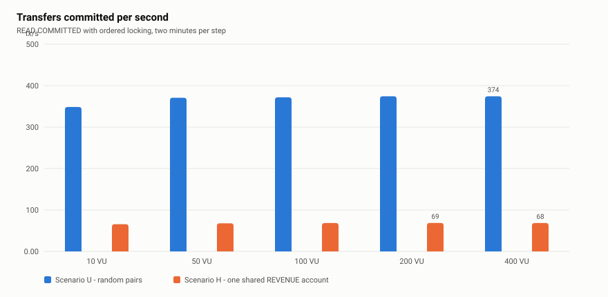
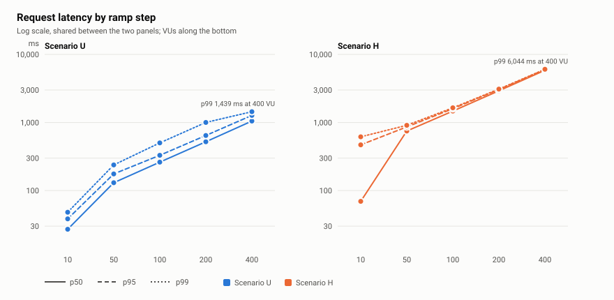
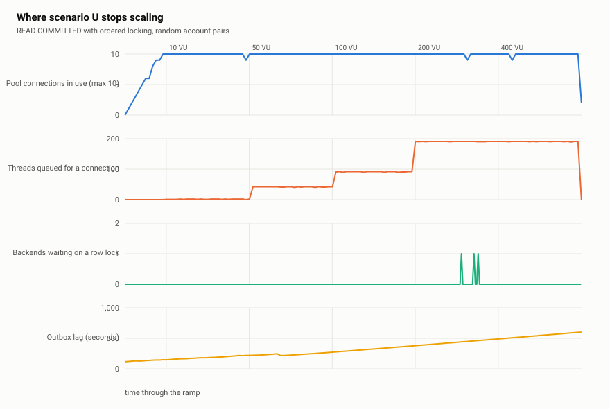
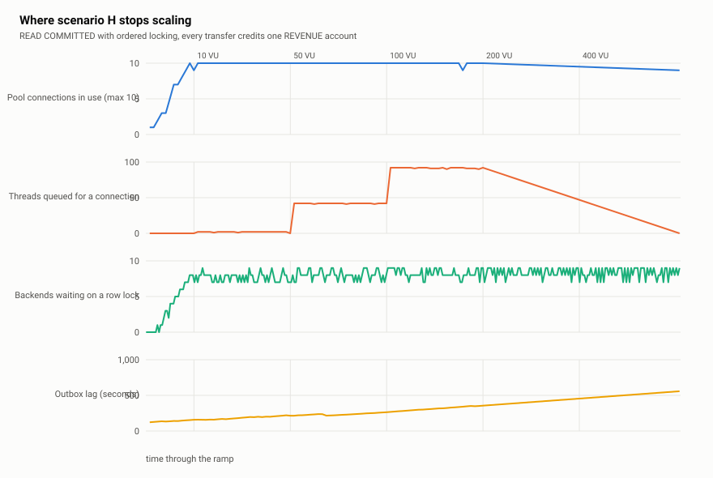
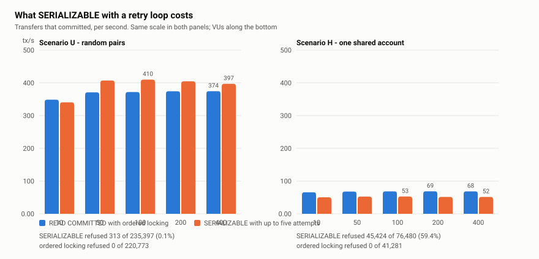

# Phase 5 — Load test results

What the ledger's ceiling is, and what sets it. Everything below was measured on 2026-09-07.
Nothing was tuned to improve a number, and the numbers that came out low are explained rather
than fixed: phase 5 measures.

Four runs, each preceded by emptying the database and rebuilding ten thousand funded accounts,
so all four ramps read indexes the same depth.

| Run | Scenario | Concurrency strategy |
|---|---|---|
| `u-read-committed` | uniform | READ COMMITTED, ordered `FOR UPDATE` locking |
| `h-read-committed` | hot account | READ COMMITTED, ordered `FOR UPDATE` locking |
| `u-serializable` | uniform | SERIALIZABLE, no explicit locks, up to five attempts |
| `h-serializable` | hot account | SERIALIZABLE, no explicit locks, up to five attempts |

## The setup

| | |
|---|---|
| Machine | AMD Ryzen 5 7535HS, 6 cores / 12 threads, 15.2 GB RAM, Windows 11 Pro |
| Application | Spring Boot 4.1.1 on Temurin 21.0.12, packaged jar, default JVM ergonomics (4 GB max heap), host process |
| PostgreSQL | 16.15-alpine in Docker Desktop, **host port 5433** |
| Kafka | Apache Kafka 4.3.1 (KRaft) in Docker Desktop |
| Load generator | k6 v2.2.0, **on the same machine** |
| Connection pool | HikariCP at its Spring Boot default maximum of 10 |
| HTTP | Tomcat at its defaults: 200 worker threads, accept backlog 100 |
| Ramp | 1 min warmup at 10 VUs, then 10 / 50 / 100 / 200 / 400 VUs for 2 min each |
| Accounts | 10 000 LIABILITY accounts, each funded with 1 000 000 000 kuruş, plus one EQUITY and one REVENUE |
| Transfer amount | 1 000 kuruş, so no account can run dry over a ramp |

**k6 shares the machine with everything it measures.** At 400 VUs the load generator, the JVM,
PostgreSQL, Kafka, Prometheus, Tempo and Grafana compete for twelve hardware threads. The
absolute throughput numbers are therefore a floor rather than the ceiling of the design. What
they are good for — and what this phase is about — is the comparison between two workloads and
two concurrency strategies measured under identical conditions.

## Which database every measured run used

A native PostgreSQL 18 Windows service runs on this machine on port 5432. A run pointed at it
would have produced numbers that look entirely reasonable and mean nothing, and that failure is
invisible afterwards.

So the compose PostgreSQL is published on **5433**, and every run proves where it connected
rather than asserting it. Each application instance names its connections `ledger-<run>-<epoch>`
and, once healthy, the harness asks the container how many connections by that name it is
serving. Zero aborts the run before any load is applied.

| Run | Host port used | Backends seen inside the container | Server | Cluster system identifier |
|---|---|---|---|---|
| `u-read-committed` | **5433** | 10 | PostgreSQL 16.15 | 7681416467163762722 |
| `h-read-committed` | **5433** | 10 | PostgreSQL 16.15 | 7681416467163762722 |
| `u-serializable` | **5433** | 10 | PostgreSQL 16.15 | 7681416467163762722 |
| `h-serializable` | **5433** | 10 | PostgreSQL 16.15 | 7681416467163762722 |

All four measured runs used host port 5433, the PostgreSQL 16.15 container, cluster
7681416467163762722. The proof travels in the `connection` block of each `results/*.json`. The
native instance on 5432 is PostgreSQL 18 and does not share these credentials, but the check
does not depend on that: credentials can match by accident, a cluster system identifier cannot.

---

## Scenario U — uniform, READ COMMITTED with ordered locking

Both ends of every transfer drawn at random from 10 000 accounts, so two concurrent transfers
share an account roughly one time in five thousand. This is the ledger with contention taken out
of the picture.

| VUs | Requests | 201 | Refused | Dropped | Transfers/s | p50 | p95 | p99 | max |
|---:|---:|---:|---:|---:|---:|---:|---:|---:|---:|
| 10 | 41 822 | 41 822 | 0 | 0 | **348.5** | 27.0 ms | 38.3 ms | 48.1 ms | 248.9 ms |
| 50 | 44 508 | 44 508 | 0 | 0 | **370.9** | 130.3 ms | 175.4 ms | 238.0 ms | 450.6 ms |
| 100 | 44 611 | 44 611 | 0 | 0 | **371.8** | 261.2 ms | 329.4 ms | 501.3 ms | 949.2 ms |
| 200 | 44 910 | 44 910 | 0 | 0 | **374.2** | 520.7 ms | 643.4 ms | 1 001.3 ms | 2 016.9 ms |
| 400 | 44 922 | 44 922 | 0 | 0 | **374.4** | 1 048.8 ms | 1 270.3 ms | 1 439.0 ms | 2 340.4 ms |

220 773 requests inside the measured steps, every one answered `201`. No refusals, no dropped
connections, no deadlocks, no serialization failures.

### The saturation point is 50 VUs

Throughput is flat from 50 VUs onward — 371, 372, 374, 374 — while latency doubles at every
step. That is a closed system that saturated before the second step and spent the rest of the
ramp queueing. Little's Law says so exactly:

| VUs | Transfers/s × mean latency | Implied concurrency |
|---:|---|---:|
| 10 | 348.5 × 0.0284 s | 9.9 |
| 50 | 370.9 × 0.1344 s | 49.9 |
| 100 | 371.8 × 0.2685 s | 99.8 |
| 200 | 374.2 × 0.5331 s | 199.5 |
| 400 | 374.4 × 1.0648 s | 398.6 |

Every VU added past 50 became queue, not work.

### Why 374 transfers per second: the connection pool

HikariCP is at its default maximum of 10, and it was pinned at 10 in use from the first step:

| VUs | Pool in use | Threads queued for a connection | Longest acquire wait |
|---:|---:|---:|---:|
| 10 | 10 / 10 | 2 | 0.07 s |
| 50 | 10 / 10 | 42 | 0.42 s |
| 100 | 10 / 10 | 92 | 0.93 s |
| 200 | 10 / 10 | 191 | 1.99 s |
| 400 | 10 / 10 | 191 | 1.99 s |

At 10 VUs nothing is queueing yet, so the mean latency there *is* the service time: **28.4 ms**
of held connection per transfer. Ten connections divided by that is 352 transfers per second,
and the measured plateau is 374. The pool is not a symptom; it is the arithmetic.

The queue depth stops growing at 191 between 200 and 400 VUs, which is the second limit showing
itself: Tomcat's 200 worker threads. At 400 VUs only 200 requests are inside the application at
all — 10 holding a connection, ~190 waiting for one — and the other 200 wait at the socket.
Latency doubles because the wait is now two queues deep.

### What the service time is spent on

Wait events sampled from `pg_stat_activity` every two seconds, by backend-samples over the run:

| Wait | Samples | |
|---|---:|---|
| Running | 314 | actually executing |
| `IO:WALSync` | 133 | commit fsync |
| `Client:ClientRead` | 88 | waiting for the application's next statement |
| `LWLock:WALWrite` | 79 | contending for the WAL buffer |
| `IO:WALWrite` | 8 | |
| `Lock:transactionid` | **4** | row contention — four samples in the entire run |
| `IO:DataFileRead` | 2 | almost nothing is read from disk |

After "running", the time goes to the write-ahead log. Nothing here is a query-plan problem: two
data-file reads in eleven minutes means the working set is in cache. `Lock:transactionid`
appearing four times in 330 samples is the control that makes scenario H interpretable.

### The relay is further behind than the ledger is slow

This was not what the phase set out to measure. Over the ramp the ledger committed 251 883
transactions and wrote 463 154 outbox rows — two events per transfer. The relay published about
32 892 of them.

| | |
|---|---|
| Events produced | ~702 /s |
| Events published by the relay | **~50 /s** |
| Backlog at the end of the ramp | 442 718 rows |
| `ledger_outbox_lag_seconds` at the end | **602 s** |

The relay is starved by the same pool that limits the API. It is one scheduled method taking a
batch of 100 and awaiting each send in turn, and it must win a connection out of the same ten
against 190 queued request threads. Nothing is lost — `published_at IS NULL` cannot be outrun and
the backlog drains once load stops — but a consumer reading the projection is ten minutes stale
for as long as the load lasts.

Two caveats, stated rather than smoothed over:

- **The backlog does not start at zero.** Seeding leaves about 12 000 unpublished rows, so
  `ledger_outbox_lag_seconds` already reads roughly 150 s when the ramp begins. The growth during
  the ramp is thirty times that and is what the conclusion rests on.
- **`ledger_outbox_pending` is a `COUNT(*)`** over the partial index, evaluated on every scrape.
  At a backlog of 400 000 rows that gauge is itself doing work on the same ten connections. Small
  next to 374 transfers per second, but not free, and it grows with the number it reports.

Nothing was changed in response. Written up in `docs/future.md`.

---

## Scenario H — hot account, READ COMMITTED with ordered locking

Identical to scenario U except in one expression: the destination is always the same REVENUE
account, the way a per-transfer fee would be. Same two account locks, same two entries, same two
outbox rows, same request. The only difference is that every transaction now wants one
particular row.

| VUs | Requests | 201 | Refused | Dropped | Transfers/s | p50 | p95 | p99 | max |
|---:|---:|---:|---:|---:|---:|---:|---:|---:|---:|
| 10 | 7 886 | 7 886 | 0 | 0 | **65.7** | 69.4 ms | 469.4 ms | 615.1 ms | 993.7 ms |
| 50 | 8 149 | 8 149 | 0 | 0 | **67.9** | 749.8 ms | 860.0 ms | 909.9 ms | 1 210.8 ms |
| 100 | 8 223 | 8 223 | 0 | 0 | **68.5** | 1 469.9 ms | 1 593.1 ms | 1 644.8 ms | 2 783.5 ms |
| 200 | 8 231 | 8 231 | 0 | 0 | **68.6** | 2 924.7 ms | 3 047.2 ms | 3 094.0 ms | 5 828.3 ms |
| 400 | 8 792 | 8 211 | 0 | 581 | **68.4** | 5 848.5 ms | 5 985.9 ms | 6 043.6 ms | 8 710.5 ms |

**This is the expected result and it is the project's central finding, not a defect.** Nothing
was adjusted to narrow the gap.

### The comparison

| VUs | U transfers/s | H transfers/s | H as a fraction | U p50 | H p50 |
|---:|---:|---:|---:|---:|---:|
| 10 | 348.5 | 65.7 | 19 % | 27.0 ms | 69.4 ms |
| 50 | 370.9 | 67.9 | 18 % | 130.3 ms | 749.8 ms |
| 100 | 371.8 | 68.5 | 18 % | 261.2 ms | 1 469.9 ms |
| 200 | 374.2 | 68.6 | 18 % | 520.7 ms | 2 924.7 ms |
| 400 | 374.4 | 68.4 | 18 % | 1 048.8 ms | 5 848.5 ms |

**One shared row costs a factor of 5.5, at every level of concurrency.** The ratio is constant
because both scenarios saturate at or before the first step and then queue.

### The cause is a different one from scenario U

Scenario U ran out of connection pool. Scenario H never gets that far: it runs out of *row*.

| | Scenario U | Scenario H |
|---|---|---|
| `Lock:tuple` wait samples | 0 | **354 – 420 per step** |
| `Lock:transactionid` wait samples | 4 in the whole run | 79 – 107 per step |
| Backends waiting on a lock (of 10) | 1 | **9** |
| System CPU, median | **86 %** | **36 %** |
| Deadlocks | 0 | 0 |

Nine of the ten pool connections are parked on the REVENUE row at any instant; one is doing
work. The machine is *less* busy under scenario H than under scenario U — 36 % against 86 % —
which is the cleanest evidence available that this ceiling is not made of CPU, disk or pool. It
is one row, and rows serialise.

The arithmetic matches again. Inter-departure time at saturation is **14.6 ms**, which is how
long one transaction holds the REVENUE row: `lockInIdOrder` takes both account locks before any
write and holds them to commit, so the hot row is occupied for essentially the whole
transaction. One row held for 14.6 ms is 68 transfers per second, and no number of connections
or cores changes that. Little's Law holds at every step — 10.0, 49.8, 99.5, 198.1, 392.6 against
10, 50, 100, 200, 400 VUs.

Two details worth naming:

- **Ordered locking still did its job.** Zero deadlocks across 41 281 transfers all fighting over
  one row. Contention and deadlock are different problems and only the second was ever claimed
  to be solved.
- **14.6 ms is faster than scenario U's 28.4 ms service time.** A transaction in scenario H
  mostly has the machine to itself, because the other nine are asleep on a lock. The serialised
  transaction is quicker; there is just only ever one of it.

### At 200 VUs the application stops answering its own metrics endpoint

At the 400 VU step, 581 requests were refused at the socket — the first dropped connections in
either READ COMMITTED run. Something less obvious happened at the same time:

| | Scrapes attempted | Succeeded | Failed |
|---|---:|---:|---:|
| Scenario U | 133 | **133** | 0 |
| Scenario H | 133 | 85 | **49** |

Every one of scenario H's failures falls at or after offset 425 s; the 200 VU step begins at
420 s. `scrape_duration_seconds` had already climbed to 2.7 s during the 100 VU step, then hit
the 5 s timeout and stopped returning.

The cause is the same saturation: all 200 Tomcat worker threads are blocked waiting for one of
ten connections, so no thread is left to serve `/actuator/prometheus`. **The observability
endpoint is a casualty of the condition it exists to report.**

The consequence for this report, stated plainly: for scenario H the pool, outbox and CPU series
cover the 10, 50 and 100 VU steps only. The 200 and 400 VU app-side numbers are absent because
the measurement was not taken, not because the value was zero. The database-side numbers do
cover the whole ramp, because that sampler is a psql session inside the container that owes the
application nothing. That the two measurement paths are independent is the only reason this run
is reportable at all. Written up in `docs/future.md`.

---

## The ADR-004 comparison: SERIALIZABLE with a retry loop

### What the two configurations actually are

| | Default | `serializable` profile |
|---|---|---|
| Isolation | READ COMMITTED | SERIALIZABLE |
| Ordering | every account locked `FOR UPDATE` in ascending id order | no explicit locks at all |
| On conflict | cannot happen; a conflicting pair queues | the database aborts one; it is run again |
| Attempts | 1 | up to 5 |

The second is not "the first plus SERIALIZABLE". It is the genuine alternative design — let the
database detect the conflict instead of preventing it — which means it also **stops issuing the
two `SELECT ... FOR UPDATE` statements** every transfer currently makes. That turns out to matter
more than the isolation level does.

### Scenario U under SERIALIZABLE: faster, and it refuses a few callers

| VUs | Transfers/s | vs. READ COMMITTED | 500s | Retries in step | p50 | p99 |
|---:|---:|---:|---:|---:|---:|---:|
| 10 | 340.6 | −2 % | 6 | 1 019 | 26.3 ms | 68.4 ms |
| 50 | **407.1** | **+10 %** | 95 | 1 201 | 116.4 ms | 244.7 ms |
| 100 | **409.8** | **+10 %** | 148 | 922 | 232.8 ms | 494.5 ms |
| 200 | **404.7** | **+8 %** | 34 | 1 401 | 471.6 ms | 1 026.5 ms |
| 400 | **396.9** | **+6 %** | 30 | 1 514 | 968.6 ms | 1 586.7 ms |

**SERIALIZABLE was faster.** That is not what the phase plan expected, and it is reported as
measured.

The reason is not the isolation level; it is the two statements that went away with the locking.
Per-connection service time falls from 28.4 ms to about 24.6 ms — roughly one round trip — and
with a pool of ten that is worth exactly the throughput observed. Under negligible contention
the ordered `FOR UPDATE` pair is pure overhead: it prevents a deadlock that random pairs among
ten thousand accounts were never going to have.

What it cost:

| | |
|---|---|
| Serialization failures retried | **6 326** |
| Transactions rolled back (`pg_stat_database`) | 6 663 |
| Requests that exhausted five attempts and returned 500 | **313** of 235 397 (**0.13 %**) |
| Deadlocks | 0 |

2.6 % of transactions were aborted at least once, which is worth naming: with random pairs among
ten thousand accounts, genuine write conflicts should be rare. Most of these are SSI being
conservative — predicate locks taken over index ranges on the idempotency and outbox inserts,
not two transfers actually touching one account. `LWLock:SerializableXactHash` appears in the
wait events for the first time, which is what that conservatism costs.

The tail shows it too: p99 at 10 VUs is 68.4 ms against READ COMMITTED's 48.1 ms, because a
retried request pays for both attempts and the caller waits through them. And 313 callers got a
500 for a transfer that a queue would simply have delayed. Under READ COMMITTED with ordered
locking, across all 220 773 requests of scenario U, that number was zero.

### Scenario H under SERIALIZABLE: this is the answer

| VUs | Transfers/s | vs. READ COMMITTED | 201 | 500 | Refused | p50 | p99 |
|---:|---:|---:|---:|---:|---:|---:|---:|
| 10 | 50.3 | −23 % | 6 037 | 8 698 | **59.0 %** | 92.1 ms | 147.8 ms |
| 50 | 52.5 | −23 % | 6 306 | 8 942 | **58.6 %** | 333.7 ms | 1 186.9 ms |
| 100 | 52.7 | −23 % | 6 325 | 9 471 | **60.0 %** | 590.4 ms | 2 781.8 ms |
| 200 | 51.6 | −25 % | 6 188 | 9 171 | **59.7 %** | 1 214.7 ms | 5 636.6 ms |
| 400 | 51.6 | −25 % | 6 190 | 9 142 | **59.6 %** | 2 795.3 ms | 7 005.5 ms |

Under real contention the alternative is worse on every axis at once:

| | READ COMMITTED, ordered locking | SERIALIZABLE, five attempts |
|---|---|---|
| Transfers/s | **68.4** | 51.6 (−25 %) |
| Requests refused | **0 of 41 281** | **45 424 of 76 480 (59.4 %)** |
| Serialization retries | 0 | **219 739** |
| Rollbacks / commits | 0 / 41 281 | **267 641 / 48 783** |
| p99 at 400 VUs | 6 044 ms | 7 006 ms |
| Deadlocks | 0 | 0 |

**Three callers in five get a 500,** and the survivors are served a quarter more slowly. Eighty-
five percent of transactions started never commit. Five attempts are not enough because the
conflict is not occasional — every transaction wants the same row, so a retry re-enters the same
contention that killed it, and the retries themselves become load on the row that is already the
bottleneck.

The waits confirm it is the same physical problem wearing different clothes: `Lock:tuple` still
dominates (169 – 249 samples per step, nine of ten backends parked), because a conditional
`UPDATE` on a contended row still blocks. SERIALIZABLE does not remove the queue; it converts
the tail of it into aborts.

### The verdict for ADR-004

Neither strategy is wrong in every case, and the honest summary is two sentences rather than one:

- **Without contention**, ordered locking costs about 10 % of throughput for a deadlock that was
  never going to happen. SERIALIZABLE plus retries is measurably faster and refuses 0.13 % of
  callers.
- **With contention**, ordered locking serves every caller and SERIALIZABLE refuses three in
  five while running 25 % slower. That is the case the design exists for.

A payment ledger is chosen on its worst case, not its average one, so the default stays. The
deadlock the locking prevents is real (the `bidirectionalNoDeadlock` test produces it on demand);
what phase 5 shows is that its price is about 10 % under the easy workload and its value is the
entire service under the hard one.

---

## Answering the phase's questions directly

### Where is the saturation point, and what causes it?

| Scenario | Saturates at | Ceiling | Cause |
|---|---|---|---|
| U — uniform | **50 VUs** | ~374 transfers/s | **The connection pool.** 10 connections × 28.4 ms of held connection per transfer. Behind it: WAL fsync, then Tomcat's 200 threads |
| H — hot account | **at or below 10 VUs** | ~68 transfers/s | **One row.** The REVENUE row is held 14.6 ms per transaction and nothing else can have it. Not CPU, not disk, not the pool — system CPU *falls* to 36 % while it happens |

Both are queueing ceilings, and Little's Law reconciles every step of every run to within two
percent. Past saturation, added concurrency buys latency and nothing else.

The two causes are genuinely different, and that difference is why there are two scenarios.
Enlarging the pool would move scenario U's ceiling. It would not move scenario H's by a single
transfer per second, because scenario H's ceiling is one row's serial hold time, and rows do not
have a pool size.

### Was anything tuned to improve a number?

No. HikariCP is at its Spring Boot default of 10, Tomcat at 200 threads and an accept backlog of
100, the JVM at its ergonomic defaults, PostgreSQL at the `postgres:16-alpine` defaults, the
relay at the 200 ms interval and batch of 100 it has had since phase 3. The pool of 10 is the
most consequential number in this report and it was left exactly where it was found.

### Honest limits on these numbers

- **k6 shares the machine with everything it measures.** In scenario U the machine sat at 86 %
  system CPU, so absolute throughput is a floor, not the design's ceiling. Every comparison here
  is between runs made under identical conditions, which is what the numbers are for.
- **Scenario H has no app-side metrics above 100 VUs.** The application could not serve its own
  scrape endpoint while saturated; 49 of 133 scrapes failed. Those figures are absent rather than
  guessed.
- **The outbox backlog does not start at zero.** Seeding leaves roughly 12 000 unpublished rows,
  so `ledger_outbox_lag_seconds` reads about 150 s at the start of each ramp.
- **Each run reseeds from empty**, so all four started at 10 002 accounts and ~20 000 entries.
- **One run per configuration.** These are not averaged over repeats, so small differences
  between two runs are not meaningful. The differences this report draws conclusions from are a
  factor of 5.5 and a refusal rate of 59 %.

## What this leaves for phase 6

- **ADR-004** has its numbers, and they are more interesting than "ordered locking is faster":
  under negligible contention the lock pair costs about 10 % of throughput for a deadlock that
  was never going to happen; under real contention it is the difference between every caller
  being served and three in five being refused.
- **ADR-006** — hot account contention, measured, sharded counter not implemented — has its
  measurement: 68 transfers per second, 5.5× slower than uncontended, caused by 14.6 ms of serial
  hold on one row, with nine of ten connections asleep and the CPU idle.
- Two findings are written into `docs/future.md` rather than fixed here: the relay's drain rate
  under load, and the metrics endpoint being unavailable at exactly the moment it matters.

## Reproducing this

See [README.md](README.md). In short: bring the stack up with PostgreSQL on 5433, package the
application, run `load/measure.sh`, then `python load/charts.py`. Each run writes
`results/<name>.json` carrying its own proof of which database it used.
